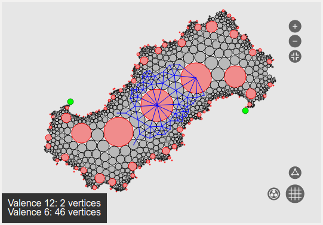

Bubble Wrap
===========

Introduction
------------

Bubble Wrap is a PyQt5 GUI tool for exploring the moduli space of
circle packing projective structures on a surface with a fixed dual
graph, and the parameterization of this space by cross ratio
invariants.  It uses the description of the moduli space developed by
Sadayoshi Kojima, Shigeru Mizushima, and Ser Peow Tan in the paper:

[Circle Packings on Surfaces with Projective Structures](http://projecteuclid.org/euclid.jdg/1090426770)

Requirements
------------

* Python 3.4+
* PyQt5
* Numpy
* PyOpenGL

Development Status
------------------

Bubble Wrap is pre-alpha; its main features are still under development.

Development Team
----------------

Bubble Wrap was developed in a Summer 2016 project of the
[Mathematical Computing Laboratory](http://mcl.math.uic.edu/) at
[UIC](http://uic.edu/).

Student researchers:

* Kimberly Kim
* Jacob Lewis

Mentors:

* David Dumas
* Ellie Dannenberg

Maintainer
----------

David Dumas <david@dumas.io>
